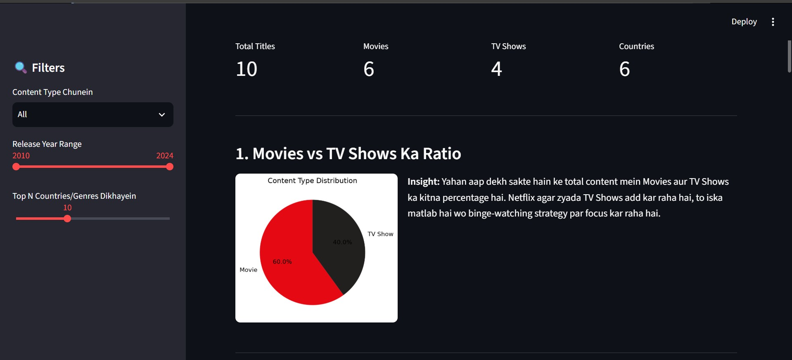

# 🎬 Netflix Content Analysis Dashboard

An interactive data analysis dashboard built on the Netflix Movies and TV Shows
dataset. This project demonstrates end-to-end data analysis — from data
cleaning and exploratory data analysis (EDA) to building an interactive
visualization dashboard — to uncover trends in Netflix's content library.

## 🛠️ Tools & Libraries Used
- **Python** – core programming language
- **Pandas** – data cleaning and manipulation
- **NumPy** – numerical operations
- **Matplotlib** – static data visualizations
- **Seaborn** – advanced statistical charts
- **Streamlit** – interactive web dashboard

## 📊 Dashboard Features
- Sidebar filters: Content Type, Release Year Range, Top N Countries/Genres
- Real-time metrics: Total Titles, Movies, TV Shows, Countries
- 6 interactive visualizations:
  1. Movies vs TV Shows distribution (Pie Chart)
  2. Year-wise content growth trend (Line Chart)
  3. Top content-producing countries (Bar Chart)
  4. Top genres on Netflix (Bar Chart)
  5. Content rating distribution (Count Plot)
  6. Month vs Year content-addition heatmap

## 🔍 Key Insights
- Netflix's content library shows a sharp growth trend leading up to **2026**,
  reflecting the platform's continued investment in original and licensed content.
- **Pakistan** emerges as a notable content-associated market in the dataset,
  highlighting the growing regional relevance of Netflix's catalog.
- The dashboard identifies the most dominant genres, helping visualize Netflix's
  overall content strategy across categories.
- Rating distribution analysis reveals which audience segments (age groups)
  Netflix content is primarily targeted toward.

> These insights are generated dynamically from the dataset using the
> dashboard's interactive filters and can be explored further by adjusting
> the year range, content type, and country/genre parameters.

## ⚙️ How to Run Locally

1. Clone this repository or download the project files
2. Navigate into the project folder via terminal
3. Install the required dependencies:
   ```bash
   pip install -r requirements.txt
   ```
4. Run the Streamlit app:
   ```bash
   streamlit run app.py
   ```
5. The dashboard will open automatically in your browser, or visit
   `http://localhost:8501`

## 📁 Project Structure
```
netflix-analysis-dashboard/
   ├── app.py
   ├── requirements.txt
   ├── netflix_titles.csv
   ├── screenshot1.png
   ├── .gitignore
   └── README.md
```

## 📸 Screenshots


## 🚀 Live Demo
[Live Dashboard](https://your-app-link.streamlit.app)

## 👤 Author
**Muhammad Ahsan**
📍 Pakistan | 2026

- GitHub: [ahsanadeem840-ai](https://github.com/ahsanadeem840-ai/netflix-analysis-dashboard)
- LinkedIn: [Muhammad Ahsan](https://www.linkedin.com/in/muhammad-ahsan-8a2552404)

---
*This project was built as part of a data analysis portfolio, showcasing
skills in Python, data wrangling, statistical visualization, and building
interactive dashboards for real-world datasets.*
